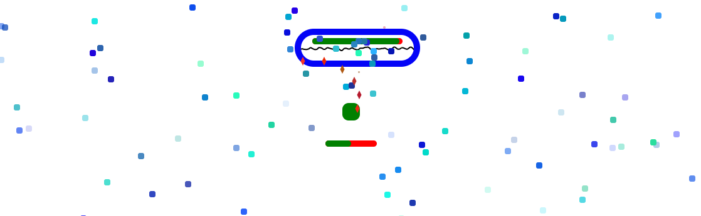

Hack-A-Day is a project I'm doing in November, where I try to make 30 new projects, in 30 days.

# Day 22: Hack-A-Battle

A bullet hell / music visualizer.

Demo available [here](https://tilde.za3k.com/hackaday/hell).

Source available on [github](https://github.com/za3k/day22_hell).

## Credits

Default songs are
- (Tutorial) "The 4t of May" by [Maarten Schellekens](https://freehellarchive.org/battle/maarten-schellekens/)
- "Switch" by [Lorenzo Woodard](https://freehellarchive.org/genre/Ambient_Electronic/)
